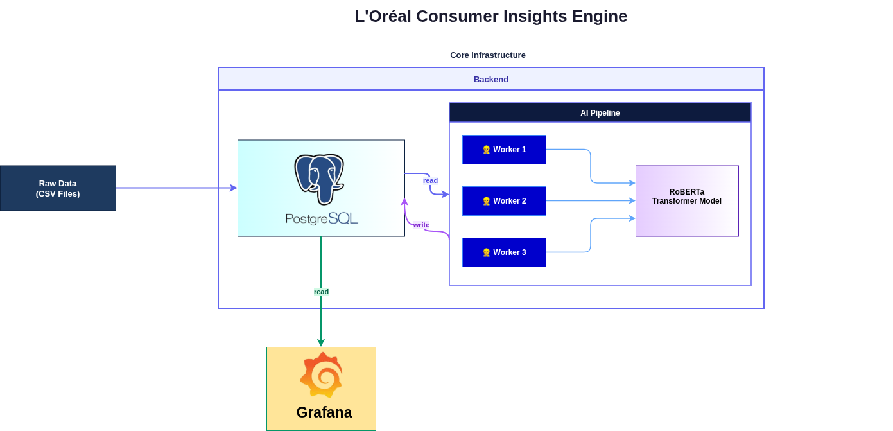

# L'Oréal Consumer Insights Engine

An AI-powered analysis pipeline designed to transform massive scale YouTube qualitative data (comments) into quantitative market intelligence for the L'Oréal Datathon.

## 🚀 Overview
This repository contains a high-performance enrichment pipeline that utilizes local NLP models (RoBERTa) to analyze sentiment and categorize feedback. It is optimized for edge computing, running entirely on local hardware to ensure data privacy and 100% reduction in cloud API costs.

## 🏗 Architecture

The pipeline is composed of three main layers:

- **Data Ingestion** — Raw CSV files are bulk-imported into the database.
- **Core Infrastructure** — A PostgreSQL/TimescaleDB instance stores raw data. The AI Enrichment Service reads unprocessed records, runs them through the RoBERTa model across multiple parallel workers, and writes enriched results back to the database.
- **Output** — Grafana reads from the database to display dashboards for sentiment trends, brand comparisons, and category breakdowns.

## 🛠 Tech Stack
- **AI/ML**: Python, PyTorch, Hugging Face Transformers (RoBERTa).
- **Database**: TimescaleDB (PostgreSQL) for high-velocity time-series data.
- **Analytics**: Grafana for real-time sentiment dashboards.
- **Infrastructure**: Docker & Docker Compose for modular service orchestration.

## 📁 Project Structure
- `src/`: Core application package (Models, Tasks, Services).
- `scripts/`: Standalone utility scripts (Model management, data cleaning).
- `main.py`: Unified Command-Line Interface (CLI).
- `docker-compose.yml`: Local environment orchestration.
- `Dockerfile`: Container definition for the enrichment service.

---
*Developed for the L'Oréal Datathon 2025.*
